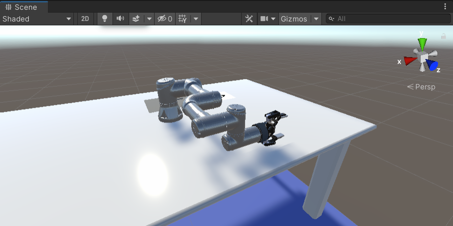
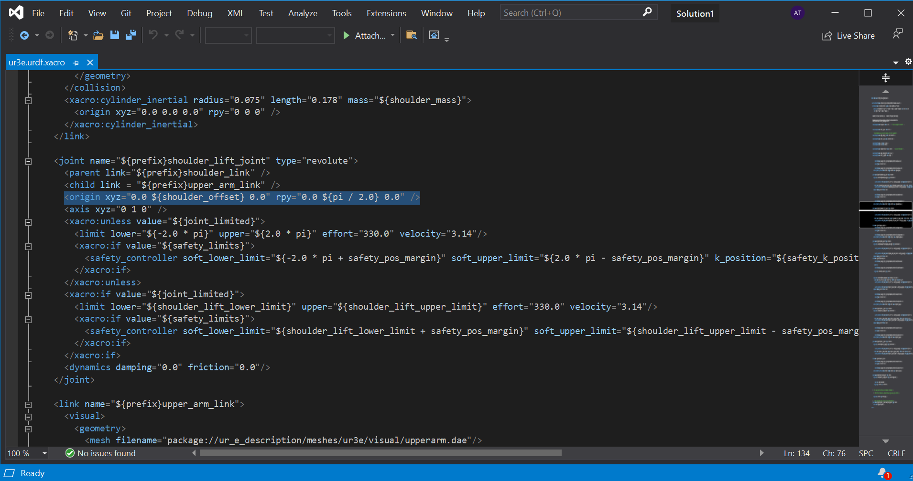
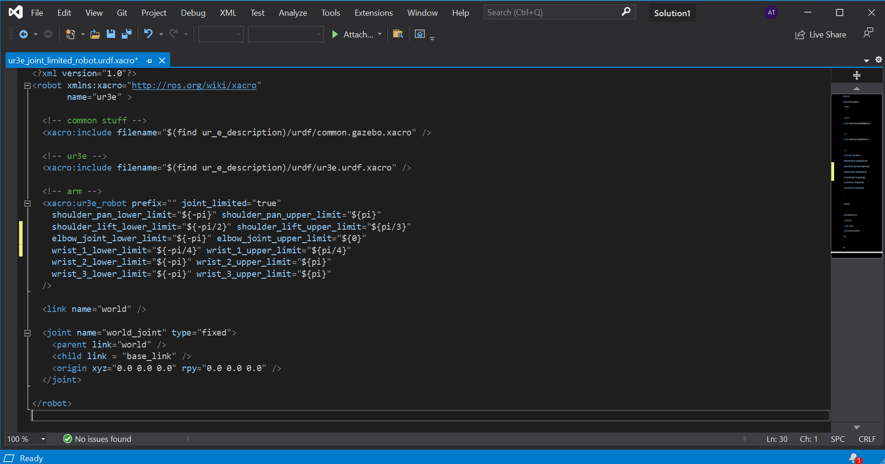

# FNAL Unity Project Tutorial: Part 1

In this first part of the tutorial, we will start by learning how to create a URDF. URDF stands for Unified Robot Description Format. The file is written in XML and is a way to describe the links, joints, shape, and movement limits.  Most robot description files you will encounter online are written not as URDFs but as XACROs or XML macros. XACROs are an easy way to separate a URDF into parts so that the URDF of a complex robot isn't extremely long and difficult to parse.  For example, there may be a XACRO for links and joints, and another for the transmission controlling the rate of joint rotation for all joints. The XACROs of different components are referenced by a 'main' XACRO that arranges them in their proper order.

Another way to use XACROs is to have a XACRO of a robot arm, and XACROs of each accessory. This way, a robot arm can be attached to many different kinds of accessories such as a gripper, a camera, or sensors, all without having to rewrite a URDF from scratch for each combination.

Unfortunately for us, Unity cant import XACROs so we will have to assemble our robot and convert our collection of XACROs into a single URDF. This tutorial will show the step-by-step process of creating a Universal-Robots model UR3e robot arm equipped with a Robotiq 2F-85 2-fingered gripper. At the time of writing this tutorial, a XACRO of the Robotiq Wrist Camera is not available.  It is possible to use the STL [provided by Robotiq](https://assets.robotiq.com/website-assets/support_documents/document/WRIST_CAMERA_20171116.STEP) to [create one](http://wiki.ros.org/sw_urdf_exporter), but it would be purely for aesthetics as its only real function in the simulation is as a spacer.

A fully modified URDF has been included in the download files for the next part. If you want to skip this step, you can proceed directly to [Part 2](2_set_up_the_scene.md).

**Table of Contents**
  - [Requirements](#reqs)
  - [Putting the files in the correct place](#step-1)
  - [Edit the XACRO](#step-2)
  - [Limiting range of movement of the virtual robot](#step-3)
  - [Converting our XACROs into a URDF](#step-4)


---

### <a name="reqs">Requirements</a>

To follow this tutorial you need to **clone** the following repositories. They contain the XACROs as well as the visual and collision meshes we will need to assemble our robot.

1. Open a terminal and navigate to the folder where you want to host the repository.

This repository contains the files for all the Universal-Robots products.
```bash
git clone --recurse-submodules https://github.com/ros-industrial/universal_robot
```
This repository contains the files for all the Robotiq products.
```bash
git clone --recurse-submodules https://github.com/ros-industrial/robotiq
```
This repository contains the files for all a custom XACRO to combine UR and Robotiq products.
```bash
git clone --recurse-submodules https://github.com/cambel/ur3
```


### <a name="step-1">Putting the files in the correct place</a>
This next step will require you to have ROS installed and a workspace created.  You can go [here](http://wiki.ros.org/ROS/Tutorials/InstallingandConfiguringROSEnvironment) if you havent done it yet.

1. Navigate to the /catkin_ws/src/ directory. You will need 3 things moved here.
2. Move or copy the universal_robot repository you cloned previously.
3. Move or copy the robotiq repository you cloned previously.
4. Move or copy the ur3_description/urdf/ur3_robotiq85_gripper.urdf.xacro file located in the cambel/ur3 repository you cloned previously.

<p align="center">

</p>

5. Open a terminal and navigate to the catkin_ws folder. Copy the following command to rebuild your catkin workspace with the new packages you have copied over so that ROS can search for files in the repositories you have copied over.

```bash
cd catkin_ws
catkin_make
```


### <a name="step-2">Edit the XACRO</a>

Once the files have been copied over, open the ur3_with_gripper.xacro file with a text editor. This will be the main XACRO that references the different parts in the correct order to assemble our robot. The XACRO written here is for a UR3 robot with a 2F-140 gripper so we will make some small modifications. First we will change the comments to reflect the changes we are making. Any references to ur3 or ur5 should be changed to ur3e. Next, on line 5, there is a reference to ur_description. We need to change it to ur_e_decription to access the files for the e-Series of robots. Similarly, the ur3.urdf.xacro filename at the end of line 5 should be changed to ur3e.urdf.xacro. Continue to change all references to match our equipment including references to the gripper and you should have something that looks like this:

<p align="center">

</p>

### <a name="step-3">Adjusting the default pose and limiting the movement range of the robot</a>

We will need to edit two files: ur3e.urdf.xacro and ur3e_joint_limited_robot.urdf.xacro. Both are located in the `/universal_robot/ur_e_description/urdf` folder.

The default pose of the robot if we build it using the provided XACROs is not ideal.



We can see in the image that the robot appears to be lying down. We should set the robot joint positions to 0 and have the robot stand up instead.  

1. Open the ur3e.urdf.xacro file in a text editor.
2. Scroll down and look for a section describing the shoulder_lift_joint. In that section, there is a line that describes the position in xyz and rotation in rpy.



3. Edit the rotation such that rpy=<0.0 0.0 0.0>
4. Do this for the wrist_1_joint as well.
5. Save and exit.

insert GIF of wonky movement

The robot does not move as expected because there is too much freedom to choose a trajectory.  The trajectory planner will sometimes select a path that is inefficient because it was the first solution it arrived at. By limiting the range of movement of the robot, we limit the number of possible paths. This way they do not include those that cause the robot to swing about and only those where the robot travels in the shortest path possible.

1. Open the ur3e_joint_limited_robot.urdf.xacro file. The real robot has 2pi rotations in either direction and here we can see that the joint is limited to positive and negative pi rotations.  Although this version is joint limited, it is not enough.
2. Edit the limits to match the following.



3. Save and exit.

### <a name="step-4">Converting our XACROs into a URDF</a>

Now that we have finished editing the ur3_with_gripper.xacro file, save it and then rename the file to ur3e_with_gripper.xacro to reflect the changes we made. Open a Terminal and navigate to the catkin_ws folder, then source your setup file by copying the following:

```bash
source devel/setup.bash
```
Then copy the following command to use the XACRO conversion function within ROS to convert our XACRO into a URDF:

```bash
rosrun xacro xacro --inorder -o ur3e_with_gripper.urdf ur3e_with_gripper.xacro
```

This command follows the format: <!--rosrun xacro xacro --inorder -o [filename of new URDF] [filename of xacro]-->

You can name the file whatever you want, but keep it simple and descriptive because we will need to keep track of it across both ROS and Unity. After running the command, you should have a URDF in the same location as the XACRO. Make a copy of this file and keep track of it because it will be copied over into two places. It is important that they be identical or there will be problems later.


 

### Proceed to [Part 2](2_set_up_the_scene.md).
