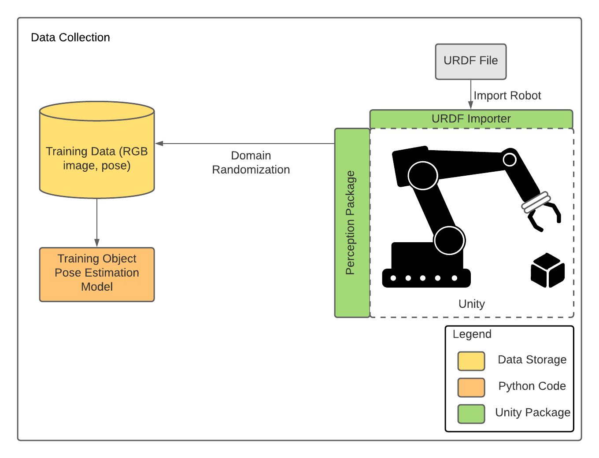
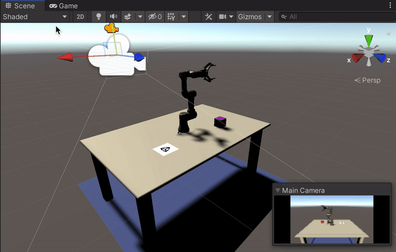
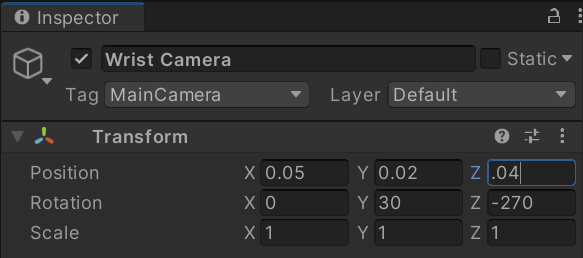
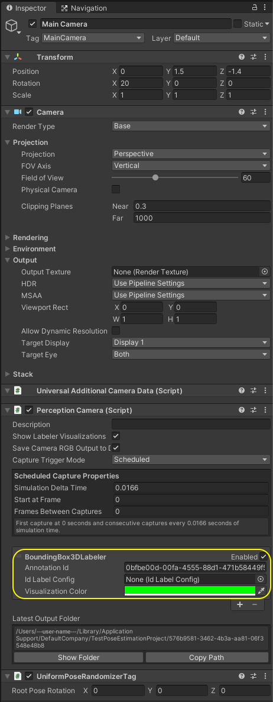
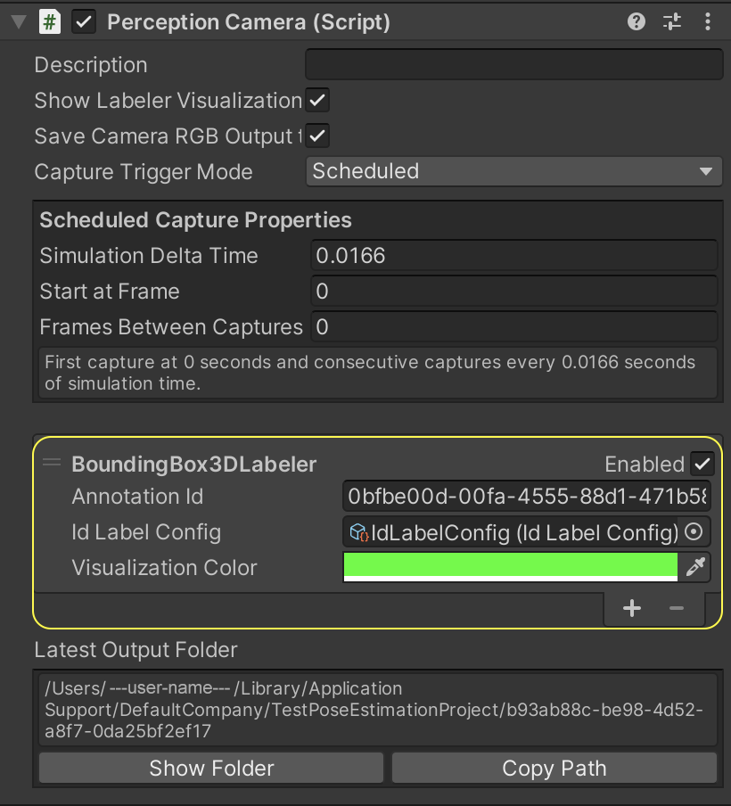
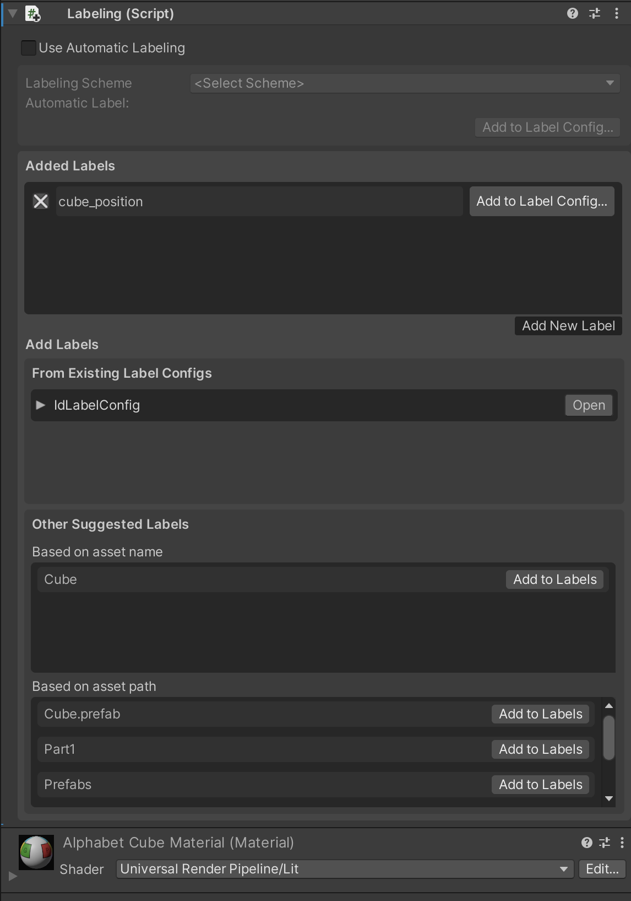

# FNAL Unity Project Tutorial: Part 3

In [Part 2](2_set_up_the_scene.md) of the tutorial, we learned:
* How to create a Unity Scene
* How to use the Package Manager to download and install Unity packages
* How to move and rotate objects in the Scene
* How to instantiate GameObjects with Prefabs
* How to import a robot from a URDF file  
    
You should now have a table, a fin, a camera, a goal, and a robot arm in your Scene. In this part we will prepare the Scene for data collection with the Perception package. 

**Table of Contents**
  - [Add a Wrist Camera to the Robot](#step-1)
  - [Add a Training Camera to the Scene](#step-2)
  - [Set Up Labelling and Label Configurations](#step-3)

---

### <a name="step-1">Add a Wrist Camera to the Robot</a>

The images you generate to train your deep learning model and the images you later use for inference during the pick-and-place task will need to have the same resolution. We will now set this resolution.

1. In the ***Game*** view, click on the dropdown menu in front of `Display 1`. Then, click **+** to create a new preset. Make sure `Type` is set to `Fixed Resolution`. Set `Width` to `650` and `Height` to `400`. The gif below depicts these actions. You can name this preset 'Tutorial.'

We now need to add a camera to the robot's wrist to mimic the Robotiq Wrist camera attached to our actual robot.

2. Open the `ur3e_with_gripper` GameObject hierarchy child links all the way down to ee_link.

3. Right click ee_link and select `Create > Camera`. There will now be a camera affixed to the end effector of the robot and the camera origin is tied to the position of the end effector, not its global position within the scene. Name this camera 'Wrist Camera'.

4. You'll notice that the camera is pointed in a strange direction and it may not be oriented correctly. Make sure the `Wrist Camera` GameObject is selected and change the coordinates to the following:

This will align the camera to the correct position and orientation to mimic the real one. 

5. Select the `Wrist Camera` GameObject in the _**Hierarchy**_ tab and in the _**Inspector**_ tab, click on _**Add Component**_.

6. Start typing `Perception Camera` in the search bar that appears, until the `Perception Camera` script is found, with a **#** icon to the left.

7. Click on this script to add it as a component. Your camera is now a `Perception` camera.

8. From the top menu bar of the editor, go to `Edit > Project Settings > Editor` and uncheck `Asynchronous Shader Compilation` under `Shader Compilation` options.

In the ***Inspector*** view for the `Perception Camera` component, you can see an empty list (`List is Empty`). This is the list of Labelers. For each type of ground-truth you wish to generate alongside your captured frames, you will need to add a corresponding Labeler to this list. In our project we want to extract the position and orientation of an object, so we will use the `BoundingBox3DLabeler`. 

There are several other types of Labelers available, and you can even write your own. If you want more information on Labelers, you can consult the [Perception package documentation](https://github.com/Unity-Technologies/com.unity.perception).

9. In the _**Inspector**_ view of the `Perception Camera` component, click on the _**+**_ button at the bottom right corner of the `List is Empty` field, and select `BoundingBox3DLabeler`. 

This Labeler will annotate the captured output with 3D bounding boxes of GameObjects in the Scene that are labelled. If the `Perception Camera`'s `Show Labeler Visualizations` option is enabled, these bounding boxes will also be visualized in real-time in the ***Scene*** view as data is generated. We will next learn how to set up this Labeler.

Once you add the Labeler, the ***Inspector*** view of the `Perception Camera` component will look like this:

Also, change the `Tag` of the `Wrist Camera` to MainCamera, then uncheck the box next to its name.  This camera will be used during the simulation, but not the data collection portion of this tutorial so we will not need it yet.

---

### <a name="step-2">Add a Training Camera to the Scene</a>

This will be very similar to setting up the `Wrist Camera` except this time, the Training Camera will have its origin fixed in space.

3. Right click the scene name in the _**Hierarchy**_ tab and select `Create > Camera`. There will now be a floating camera within the scene. Name this camera 'Training Camera'.

4. Make sure the `Training Camera` GameObject is selected and change the coordinates to the following:

This will align the camera to the correct position and orientation to mimic `Wrist Camera` when it is position to capture an image. 

5. Select the `Training Camera` GameObject in the _**Hierarchy**_ tab and in the _**Inspector**_ tab, click on _**Add Component**_.

6. Start typing `Perception Camera` in the search bar that appears, until the `Perception Camera` script is found, with a **#** icon to the left.

7. Click on this script to add it as a component. Your camera is now a `Perception` camera.

9. In the _**Inspector**_ view of the `Perception Camera` component, click on the _**+**_ button at the bottom right corner of the `List is Empty` field, and select `BoundingBox3DLabeler`. 

10. Also change the `Tag` of this camera to `Main Camera` and scroll down and uncheck the `Audio Listener` box.

### <a name="step-3">Set Up Labelling and Label Configurations</a>

Our work above prepares us to collect RGB images from the camera and associated 3D bounding boxes for objects in our Scene. However, we still need to specify _which_ objects we'd like to collect poses for using the Labeler we added. In this tutorial, we will only collect the pose of the cube, but you can add more objects if you'd like.

You will notice that the `BoundingBox3DLabeler` component has a field named `Id Label Config`. The label configuration we link here will determine which objects' poses get saved in our dataset. 

1.  In the _**Project**_ tab, right-click the `Assets` folder, then click `Create -> Perception -> Id Label Config`.

This will create a new asset file named `IdLabelConfig` inside the `Assets` folder.

This type of label configuration includes a list of labels, each with a numerical ID. By assigning this configuration to a Labeler, we tell the Labeler to only capture objects that carry labels that are included in the configuration's list of labels, and ignore the rest of the objects in the Scene. We will now assign this configuration the `BoundingBox3DLabeler` we just added to the `Perception Camera` component.

2. Select the `Main Camera` object from the _**Hierarchy**_ tab, and in the _**Inspector**_ tab, assign the newly created `IdLabelConfig` asset to the `Id Label Config` field. To do so, you can either drag and drop the former into the corresponding field of the Labeler, or click on the small circular button in front of the `Id Label Config` field, which brings up an asset selection window filtered to only show compatible assets. 

The `Perception Camera` component will now look like the image below:

Now we need to assign a label to the `Cube` object, and add the same label to `IdLabelConfig`, since it is the pose of the cube we wish to collect. 

3. Select the `Cube` GameObject and in the _**Inspector**_ tab, click on the _**Add Component**_ button.

4. Start typing `Labeling` in the search bar that appears, until the `Labeling` script is found, with a **#** icon to the left. Click on this script. 

5. In the UI that appears, click the **Add New Label** button and change `New Label` to `cube_position`. Then, click on `Add to Label Config...`, and below `Other Label Configs in Project` there should be `IdLabelConfig`. Click on `Add Label` and then close the window. 

The `cube_position` label is now added to both the `Cube` object and the `IdLabelConfig` label configuration.

The _**Inspector**_ view of the `Cube` should look like the following:

### Proceed to [Part 4](4_creating_randomizers.md).