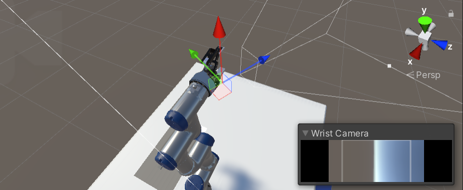

# FNAL Unity Project Tutorial: Part 4

In [Part 3](3_set_up_the_data_collection_scene.md) of the tutorial, we learned:
*   
    
In this part, we will additional cameras for viewing the gripper interact with the fin, a wrist mounted camera, and a randomized training camera that will capture images from the perspective of the wrist camera.

**Table of Contents**
  - [Add Gripper Cameras and Gripper Controls](#step-1)
  - [Add a Wrist-mounted Camera](#step-2)
  - [Add a Randomized Training Camera](#step-3)

---

### <a name="step-1">Add Gripper Cameras and Gripper Controls</a>
---

### <a name="step-2">Add a Wrist-mounted Camera</a>
---

### <a name="step-3">Add a Randomized Training Camera</a>

