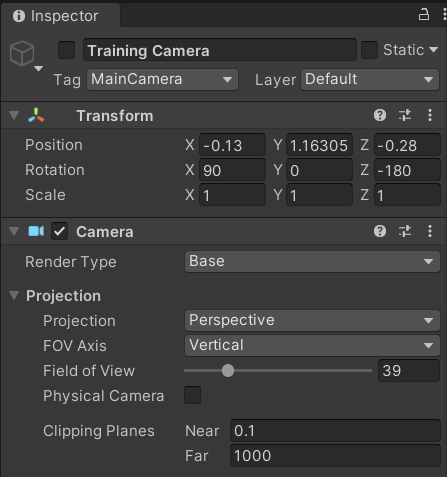

# More Randomizers

In the main tutorial, we randomized the position and rotation of the cube. However, the Perception Package supports much more sophisticated environment randomization. In this (optional) section we will create a richer and more varied environment by adding one more Randomizer to our scene.

In addition to the `YRotationRandomizer` and the `RobotArmObjectPositionRandomizer`, we have designed one more Randomizer: 
* The `CameraRandomizer` randomizes a camera's rotation at a fixed position, over a specified range. We will apply this to the camera, to make our trained model more robust to small inaccuracies in placing the real camera.

### Randomizing the Camera Pose

Below is the code for the `CameraRandomizer`.


```C#
using System.Collections;
using System.Collections.Generic;
using System;
using UnityEngine;
using UnityEngine.Perception.Randomization.Parameters;
using UnityEngine.Perception.Randomization.Randomizers;
using UnityEngine.Perception.Randomization.Samplers;

[Serializable]
[AddRandomizerMenu("Perception/Camera Randomizer")]
public class CameraRandomizer : Randomizer
{
    //public FloatParameter lightIntensityParameter = new FloatParameter { value = new UniformSampler(.9f, 1.1f) };

    public FloatParameter rotationX = new FloatParameter { value = new UniformSampler(40, 80) };

    public FloatParameter rotationY = new FloatParameter { value = new UniformSampler(-180, 180) };

    public FloatParameter rotationZ = new FloatParameter { value = new UniformSampler(-180, 180) };

    protected override void OnIterationStart()
    {
        /*Runs at the start of every iteration*/
        IEnumerable<CameraRandomizerTag> tags = tagManager.Query<CameraRandomizerTag>();

        foreach (CameraRandomizerTag tag in tags)
        {
            //var light = tag.gameObject.GetComponent<Light>();
            //light.intensity = lightIntensityParameter.Sample();
            //light.color = lightColorParameter.Sample();

            Vector3 rotation = new Vector3(rotationX.Sample(), rotationY.Sample(), rotationZ.Sample());
            tag.gameObject.transform.rotation = Quaternion.Euler(rotation);
        }

    }
}

```

In the same way we tagged the object, we can now tag a camera.  Create a new camera in the position above the object and name it `TrainingCamera`.  Then add the CameraRandomizerTag to it and make sure the FOV and and other settings match.

<p align="center">

</p>

Here we can see screen captures where both the object and the camera positions are randomized.

<p align="center">

</p>
