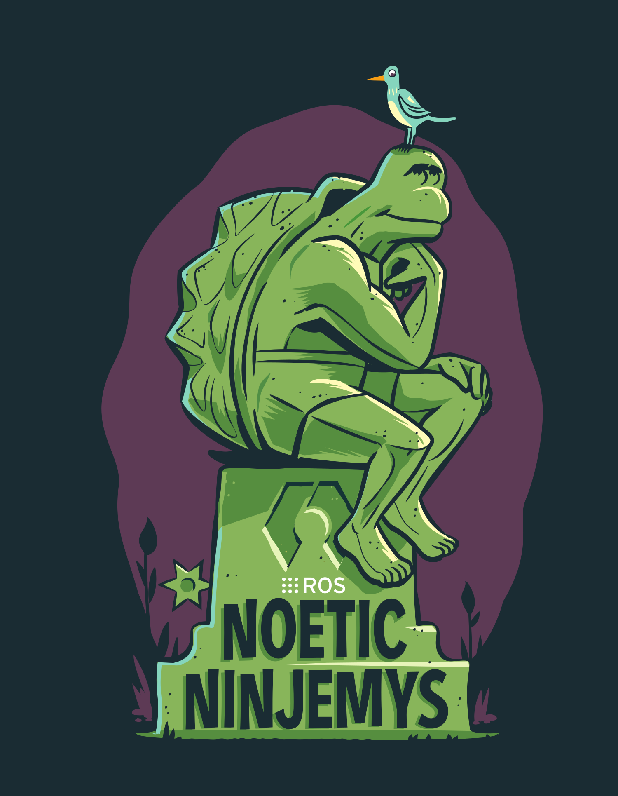

# ROS Basics

The Robot Operating System (ROS) is a set of software libraries and tools that help you build robot applications. You can read more about ROS [here](http://https://www.ros.org/).  There are tutorials to help you get set up.

Basically, there are packages that contain python scripts, XML files, and configuration files. The scripts can be written to launch nodes that handle tasks.  Nodes communicate through topics that they subscribe or publish to. Publishers send messages to those topics and subscribers listen to those topics for new messages. Nodes can be either, both, or neither.

Topics are not the only way that nodes communicate. They can send direct messages to eachother by using a service. A service provides a direct line to a particular node.  By sending a message to a service, you can communicate directly with a node in the form of a request/response.  In the previous section of this tutorial, we saw this with the `InvokePoseEstimationService`.

There is a lot more to ROS but for the purposes of this project, at this stage, this is all we will go into here. For adapting this project for use with a real UR3e, in-depth knowledge about controllers and communication between `Moveit!` nodes and services will be needed. For future work, this is where the focus should be.

This tutorial will demonstrate how to use Docker to create a virtual machine instance of ROS with the `ur3_moveit package`.  While it is convenient for setting up the demo, it will be necessary to have a separate machine to run ROS permanently so that changes can be made to packages, scripts, configuration files, etc. This is because a docker image must be rebuilt every time a change is made.  The instructions on the Docker setup can be found in the pick and place part of this tutorial.

### Proceed to [Part 8](8_ur3moveit.md).
