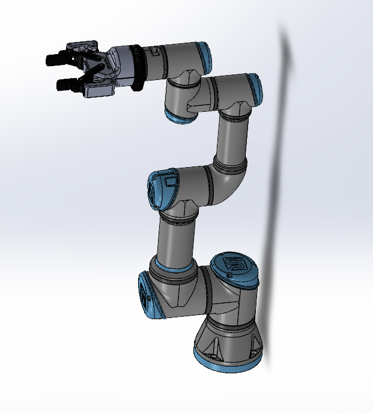
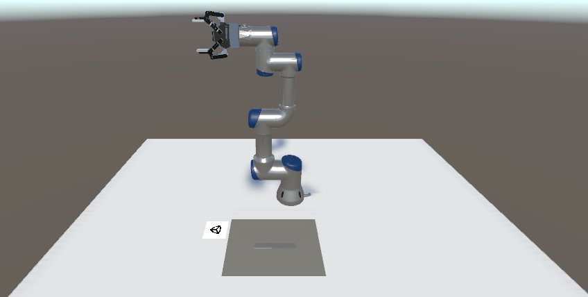
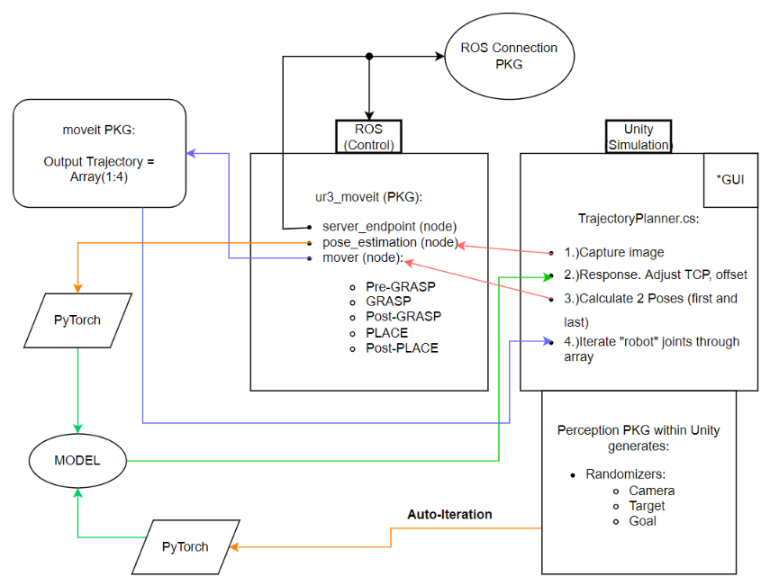

# FNAL Unity Project

This tutorial will go through the steps necessary to perform pose estimation with a UR3e robotic arm in Unity. You’ll gain experience integrating ROS with Unity, creating and importing URDF models, collecting labeled training data, and training and deploying a deep learning model. By the end of this tutorial, you will be able to perform pick-and-place with a robot arm in Unity, using computer vision to perceive the object the robot picks up.

This tutorial was created by [Team 41](Documentation/team41.md) of the senior class of 2022 of the [University of Illinois at Chicago (UIC)](http://mie.uic.edu). This tutorial is built upon the work done by Unity Technologies for their [Robotics Object Pose Estimation Demo](https://github.com/Unity-Technologies/Robotics-Object-Pose-Estimation). Many portions of this tutorial are identical to the tutorial by Unity Technologies. Additional descriptions for certain items and steps taken by Team 41 specific to the senior design project were added to facilitate the continuation of our work by future senior design teams at UIC. This project was sponsored by [Fermilab](http://fnal.gov) who provided the UR3e, gripper, and camera to test our code on. Thank you to Dr. Katsuya Yonehara and George Lolov of Fermilab for their support.

> Note: This project has been developed with Python 3 and ROS Noetic.

**Table of Contents**

- [Part 1: Creating a URDF](#link-part-1)
- [Part 2: Create a Unity scene with an imported URDF](#link-part-2)
- [Part 3: Setting up a scene in Unity for data collection](#link-part-3)
- [Part 4: Creating Randomizers](#link-part-4)
- [Part 5: More Randomizers](#link-part-5)
- [Part 6: TrajectoryPlanner.cs and how it works](#link-part-6)
- [Part 7: ROS Files and Basics](#link-part-7)
- [Part 8: ROS nodes in the ur3_moveit package](#link-part-8)
- [Part 9: Data Collection and Model Training](#link-part-9)
- [Part 10: Pick-and-Place](#link-part-10)
- [Part 11: Connecting ROS to a real UR3e](#link-part-11)

---

### <a name="link-part-1">[Part 1: Creating a URDF](Documentation/1_creating_a_urdf.md)</a>

This part is about setting up a URDF or Unified Robot Description Format file that we can import into our simulation.

---

### <a name="link-part-2">[Part 2: Create a Unity scene with an imported URDF](Documentation/2_set_up_the_scene.md)</a>

This part includes downloading and installing the Unity Editor, setting up a basic Unity scene, and importing a robot. We will import the URDF we created in step 1 using the [URDF Importer](https://github.com/Unity-Technologies/URDF-Importer) package.

---

### <a name="link-part-3">[Part 3: Setup the Scene for Data Collection](Documentation/3_set_up_the_data_collection_scene.md)</a> 

This part focuses on setting up the scene for data collection using the Unity Computer Vision [Perception Package](https://github.com/Unity-Technologies/com.unity.perception). You will learn how to use Perception Package [Randomizers](https://github.com/Unity-Technologies/com.unity.perception/blob/master/com.unity.perception/Documentation~/Randomization/Index.md) to randomize aspects of the scene in order to create variety in the training data. 

---

### <a name="link-part-4">[Part 4: Creating Randomizers](Documentation/4_creating_randomizers.md)</a> 

This part focuses on creating our own randomizers for the training camera.

If you would like to learn more about Randomizers, and apply domain randomization to this scene more thoroughly, check out our further exercises for the reader [here](Documentation/5_more_randomizers.md).

---

### <a name="link-part-5">[Part 5: More Randomizers](Documentation/5_more_randomizers.md)</a> 

This part will help set up a camera randomizer for a more robust model.

---

### <a name="link-part-6">[Part 6: TrajectoryPlanner.cs and How It Works](Documentation/5_trajectoryplanner.md)</a> 

This part focuses on explaining the TrajectoryPlanner.cs script, which is the heart of the simulation in Unity.

---

### <a name="link-part-7">[Part 7: Ros Files and Basics](Documentation/7_ROS.md)</a> 

This part focuses on giving a very basic explanation of how ROS works and the setup of the Docker container that will run it.

---
### <a name="link-part-8">[Part 8: ROS Nodes in the ur3moveit Package](Documentation/7_ur3moveit.md)</a> 

This part focuses on explaining the different parts of the ur3_moveit package and how they work.

---
### <a name="link-part-9">[Part 9: Data Collection and Model Training](Documentation/4_data_collection_model_training.md)</a>

This part includes running data collection with the Perception Package, and using that data to train a deep learning model. The training step can take some time. If you'd like, you can skip that step by using our pre-trained model.

To measure the success of grasping in simulation using our pre-trained model for pose estimation, we did 50 trials and got the following results:

|                   | Success | Failures | Percent Success |
|:-----------------:|:-------:|:--------:|:---------------:|
|Fully in-plane     |    25   |     3    |      89         |
|Partially in-plane |    16   |     6    |      73         |
|All                |    41   |     9    |      82         |

---

### <a name="link-part-10">[Part 10: Pick-and-Place](Documentation/9_pick_and_place.md)</a>

This part includes the preparation and setup necessary to run a pick-and-place task using MoveIt. Here, the fin pose is predicted by the trained deep learning model. Steps covered include:
* Creating and invoking a motion planning service in ROS
* Sending captured RGB images from our scene to the ROS Pose Estimation node for inference
* Using a Python script to run inference on our trained deep learning model
* Moving Unity Articulation Bodies based on a calculated trajectory
* Controlling a gripping tool to successfully grasp and drop an object.

---

### <a name="link-part-11">[Part 11: Connecting ROS to a real Robot](Documentation/10_ROS_real_robot.md)</a>

This part will explain how to connect what we have done to an actual UR3e and move from simulation into the real world.

---

## Support
For questions or discussions about Unity Robotics package installations or how to best set up and integrate your robotics projects, please create a new thread on the [Unity Robotics forum](https://forum.unity.com/forums/robotics.623/) and make sure to include as much detail as possible.

For feature requests, bugs, or other issues, please file a [GitHub issue](https://github.com/Unity-Technologies/Robotics-Object-Pose-Estimation/issues) using the provided templates and the Robotics team will investigate as soon as possible.

For any other questions or feedback, connect directly with the
Robotics team at [unity-robotics@unity3d.com](mailto:unity-robotics@unity3d.com).

## More from Unity Robotics
Visit the [Robotics Hub](https://github.com/Unity-Technologies/Unity-Robotics-Hub) for more tutorials, tools, and information on robotics simulation in Unity!

## License
[Apache License 2.0](LICENSE)
